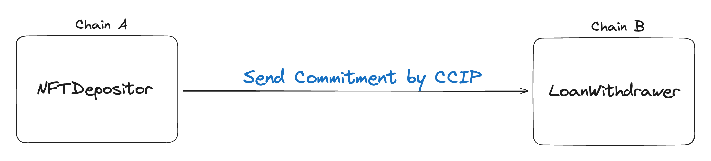

# ZadeLend: Cross-Chain Asset Collateralized Loan with ZK Withdrawal

ZadeLend is a cross-chain, privacy-preserving lending protocol where users deposit assets on Ethereum L1 and privately withdraw stablecoin loans on L2. Using zero-knowledge proofs and Chainlink CCIP, the system ensures unlinkable transactions with verifiable execution. Users earn stablecoins instantly upon Asset deposit, then later withdraw loans without revealing which asset they used. All actions are trustless and private — loan amounts are public, but user identities and asset details remain hidden.

## Key Features

- Privacy-preserving loan withdrawals: Only the proof is public, not which asset was deposited.
- Cross-chain communication: Chainlink CCIP for secure message passing.
- Double-spend prevention: Nullifiers mapping prevents reusing proofs.
- Time-locked collateral: User assets are locked on the origin chain for a fixed period.
- Reward-based incentive: Users are rewarded with USDC on deposit to encourage participation.

## Smart Contract Responsibilities

### AssetDepositor (Chain A)
- Stores and locks assets.
- Emits AssetDeposit events.
- Sends commitments cross-chain via Chainlink CCIP.
- Manages LINK fee balances.
- Allows user to payback USDC to unlock their collateral.

### LoanWithdrawer (Chain B)
- Maintains a Merkle Tree of commitments.
- Receives and logs commitments via _ccipReceive().
- Validates ZK withdrawal via loanWithdraw():
- Ensures the proof is valid.
- Checks nullifier not used.
- Transfers loanAmount in USDC to the user.

## Overview of the flow

### Step 1: Deposit Asset on Chain A (e.g., L1)

#### User

- Approves the contract to transfer their asset.
- Generates a commitment using their secret and loan amount.
- Submits the commitment along with their asset.

#### Contract

- Locks the assets.
- Sends the commitment to Chain B via Chainlink CCIP.
- Mints a reward of 100 USDC to the user as a "deposit reward."

### Step 2: On Chain B (e.g., L2 or Privacy Layer)

#### Contract

- Receives the commitment via CCIP.
- Inserts it into a Merkle Tree (`_insert()`).
- Emits `LeafCommitment(commitment, leafIndex)`.

### Step 3: User Withdraws Loan Anonymously

#### User
- Generates a ZK proof off-chain proving:
- Their commitment exists in the Merkle Tree.
- Their nullifier is unique.
- They are entitled to the specific loanAmount.
- Submits the ZK proof, root, public nullifier, and public loanAmount.

#### The contract:
- Validates the proof via the IVerifier contract.
- Ensures the nullifier hasn't been used.
- Transfers loanAmount USDC to the user.

## Future Improvement
- Dynamic Loan Terms Based on NFT Appraisal
  Integrate decentralized Asset pricing oracles to offer personalized loan amounts and risk-adjusted interest rates.
- Multi-Asset Collateral Support
  Let users deposit ERC20s or multiple NFTs to diversify collateral and reduce over-collateralization risk.

## Final Summary
This project implements a trustless, privacy-preserving, cross-chain asets collateral system.
It uses Chainlink CCIP for messaging and ZK-SNARKs for anonymous loan withdrawals. The asset depositor contract locks user assets and rewards them, while the withdrawal contract validates zero-knowledge proofs to release stablecoin loans on a different chain — with no link between the deposit and withdrawal accounts.
